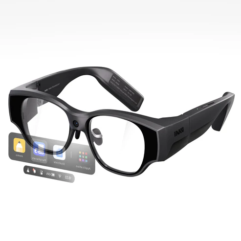
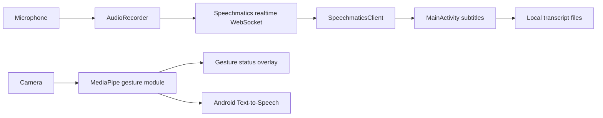

<div align="center">

# 字幕眼鏡 Android Demo

即時語音轉文字、語者分離、字幕顯示與手勢辨識的 Android 原型。




[Overview](#overview) · [Features](#features) · [Quick start](#quick-start) · [Configuration](#configuration) · [Troubleshooting](#troubleshooting)

</div>

---

## Overview

This project is an Android demo for a smart-glasses-style subtitle workflow. It records microphone audio, streams it to Speechmatics for real-time transcription and speaker diarization, then displays the transcript with speaker labels and colors.

The app also integrates a separate MediaPipe gesture-recognition module. While recording, gesture detection can run in the background and optionally announce gesture results through Android Text-to-Speech.

## Features

| Feature | What it does | Main files |
| --- | --- | --- |
| Real-time transcription | Streams 16 kHz mono microphone audio to Speechmatics WebSocket | `AudioRecorder.java`, `SpeechmaticsClient.java` |
| Speaker diarization | Separates speakers and maps labels such as `S1`, `S2`, `S3` | `SpeechmaticsClient.java`, `AppConfig.java` |
| Speaker enrollment | Records local samples and calls Speechmatics speaker enrollment APIs | `SpeakerEnrollmentActivity.java`, `SpeechmaticsEnrollmentClient.java` |
| Subtitle display | Shows transcript text with speaker color separation | `MainActivity.java`, `TranscriptListAdapter.java` |
| Transcript management | Saves, lists, renames, deletes and reloads transcript text files | `TranscriptManager.java`, `SettingsActivity.java` |
| Gesture recognition | Runs MediaPipe gesture recognition from the `:gesture` module | `gesture/src/main/java/.../GestureBackgroundRunner.kt` |
| Text-to-Speech | Announces gesture output or other configured results | `MainActivity.java`, `SettingsActivity.java` |
| Settings screen | Adjusts language, font size, TTS engine, speaker names and output behavior | `SettingsActivity.java` |

## Architecture



## Tech stack

| Area | Technology |
| --- | --- |
| App platform | Android app module `:app` |
| Gesture module | Android library module `:gesture` |
| Languages | Java 11, Kotlin 2.1.0 |
| Build system | Gradle, Android Gradle Plugin 8.13.0 |
| Speech API | Speechmatics real-time WebSocket and speaker APIs |
| Networking | OkHttp 4.10.0 |
| JSON parsing | Gson 2.10.1 |
| UI | AppCompat, Material Components, ConstraintLayout |
| Camera and gestures | CameraX 1.4.2, MediaPipe Tasks Vision 0.10.29 |

## Project structure

```text
.
├── app/                         # Main Android app
│   └── src/main/
│       ├── java/hk/edu/hkmu/speakerdiarazationdemo/
│       └── res/raw/
│           ├── config_example.json
│           └── config.json      # Local only, ignored by Git
├── gesture/                     # MediaPipe gesture-recognition library module
│   └── src/main/assets/
│       └── gesture_recognizer.task
├── gradle/libs.versions.toml    # Version catalog
├── settings.gradle.kts          # Includes :app and :gesture
└── inmoair3.png                 # README image
```

## Requirements

- Android Studio with Android Gradle Plugin 8.13.0 support
- JDK 11
- Android SDK:
  - `compileSdk = 36`
  - `minSdk = 28`
  - `targetSdk = 28`
- A Speechmatics API key
- Android device or emulator with microphone permission
- Camera permission and camera hardware for gesture mode

## Configuration

The app reads `app/src/main/res/raw/config.json` at runtime. This file contains your real Speechmatics API key and is intentionally ignored by Git.

Copy the safe example first:

```powershell
Copy-Item app/src/main/res/raw/config_example.json app/src/main/res/raw/config.json
```

macOS or Linux:

```bash
cp app/src/main/res/raw/config_example.json app/src/main/res/raw/config.json
```

Then edit `app/src/main/res/raw/config.json`:

```json
{
  "api_key": "YOUR_SPEECHMATICS_API_KEY",
  "language": "yue",
  "region": "usa",
  "timeout_seconds": 1.5,
  "operating_point": "enhanced",
  "max_delay_mode": "flexible",
  "enable_partials": true,
  "diarization": "speaker",
  "max_speakers": 10,
  "speaker_sensitivity": 0.6,
  "end_of_utterance_silence_trigger": 0.8,
  "audio_filter_volume_threshold": 0,
  "speaker_names": {
    "S1": "s1",
    "S2": "s2",
    "S3": "s3",
    "S4": "s4",
    "S5": "s5"
  }
}
```

Important:

- Never commit the real `config.json`.
- Do not run `git add -f app/src/main/res/raw/config.json`.
- Keep public examples using `YOUR_SPEECHMATICS_API_KEY`.

## Quick start

1. Open this repository in Android Studio.
2. Create `app/src/main/res/raw/config.json` from `config_example.json`.
3. Add your Speechmatics API key locally.
4. Run Gradle Sync.
5. Build and install the app from Android Studio, or run:

```powershell
.\gradlew.bat :app:assembleDebug
```

On macOS or Linux:

```bash
./gradlew :app:assembleDebug
```

On first launch, grant microphone permission. Grant camera permission only if you want to use gesture recognition.

## Common commands

| Task | Windows command |
| --- | --- |
| Build debug APK | `.\gradlew.bat :app:assembleDebug` |
| Run unit tests | `.\gradlew.bat test` |
| Run lint | `.\gradlew.bat lint` |
| Run Gradle checks | `.\gradlew.bat check` |
| Run instrumented tests | `.\gradlew.bat connectedAndroidTest` |

`connectedAndroidTest` requires a connected Android device or running emulator.

## Usage notes

- The main screen records audio and displays live subtitles.
- The settings screen controls language, font size, TTS engine, speaker setup and transcript management.
- Speaker enrollment records sample audio locally before calling the Speechmatics speaker API.
- Saved transcripts are stored in the app-private files directory.
- Gesture recognition uses `gesture/src/main/assets/gesture_recognizer.task`.

## Troubleshooting

| Problem | Check |
| --- | --- |
| App shows a config loading error | Confirm `app/src/main/res/raw/config.json` exists and is valid JSON. |
| Speechmatics connection fails | Check the API key, network connection, `region`, and Speechmatics account access. |
| No microphone input | Grant microphone permission and test on a device with microphone hardware. |
| Gesture recognition does not start | Grant camera permission and confirm the device has an available camera. |
| TTS does not speak | Check Android Text-to-Speech settings and installed voice data. |
| Build cannot find SDK | Open Android Studio SDK Manager and install API 36 plus required build tools. |

## Security and privacy notes

- Microphone audio is streamed to Speechmatics for transcription.
- Speaker enrollment audio and transcripts are handled locally by the app.
- `config.json` contains a real API key and must stay out of Git.
- The manifest currently enables app backup and cleartext traffic settings. Review these before using the project outside a demo or development environment.

## Gesture model

The checked-in MediaPipe gesture model lives here:

```text
gesture/src/main/assets/gesture_recognizer.task
```

To replace it, copy the new `.task` model to that path and rebuild the app.
